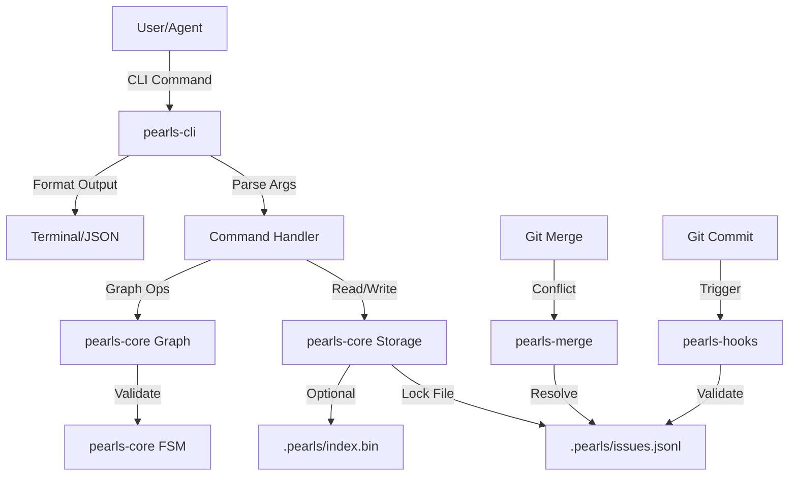

# Design Document: Pearls Issue Tracker

## Overview

Pearls is a production-grade, Git-native distributed issue tracking system implemented in Rust. The architecture is built on radical simplification: a single JSONL file serves as the source of truth, with Rust's performance enabling real-time parsing without caching layers or background daemons.

### Design Philosophy

The design follows four core principles:

1. **Simplicity First**: No background processes, no SQLite cache, no complex synchronization. Every operation is atomic and synchronous.
2. **Git as Infrastructure**: Leverage Git for versioning, conflict resolution, and distributed coordination rather than reimplementing these capabilities.
3. **Agent-Centric**: Optimize for machine readability, precise error messages, and structured output while maintaining human usability.
4. **Idiomatic and Exemplary Rust**: Adhere to Microsoft's Pragmatic Rust Guidelines, emphasizing safety, maintainability, efficiency, and intellectual honesty. All code serves as a reference implementation of production-grade Rust practices.

### Key Architectural Decisions

- **Multi-Crate Architecture**: Separate core functionality from CLI concerns for better modularity, testing, and potential library reuse
- **JSONL-Only Storage**: Single file at `.pearls/issues.jsonl` with snapshot-based persistence
- **Hash-Based Identity**: Content-addressable IDs (prl-XXXXXX) for collision-free distributed work
- **Strict FSM**: Type-system-enforced state transitions to prevent invalid states
- **DAG Dependencies**: Directed acyclic graph with cycle detection and topological sorting
- **Custom Merge Driver**: Semantic JSONL merging for conflict-free Git integration
- **Streaming Performance**: Real-time parsing with optional indexing for large repositories


## Architecture

### Multi-Crate Structure

The project is organized into multiple crates for separation of concerns:

```
pearls/
├── Cargo.toml (workspace)
├── crates/
│   ├── pearls-core/      # Core library (storage, graph, FSM)
│   ├── pearls-cli/       # CLI application
│   ├── pearls-merge/     # Git merge driver
│   └── pearls-hooks/     # Git hooks
└── docs/
```

**pearls-core**: The foundational library containing:
- Data models (Pearl struct, Dependency, Status enum)
- Storage engine (JSONL read/write, streaming, indexing)
- Graph algorithms (DAG, cycle detection, topological sort)
- FSM logic (state transitions, validation)
- Hash ID generation and resolution
- Error types and result handling

**pearls-cli**: The command-line interface:
- Argument parsing with clap
- Command implementations (init, create, show, list, etc.)
- Output formatting (JSON, table, plain)
- Terminal UI with colors and tables
- Configuration management

**pearls-merge**: The Git merge driver:
- Three-way merge logic for JSONL files
- Field-level conflict resolution
- Syntactic validation of merged output

**pearls-hooks**: Git hook implementations:
- Pre-commit validation
- Post-merge integrity checks
- Auto-close on commit message patterns

### Data Flow




## Components and Interfaces

### Core Library (pearls-core)

#### Storage Module

**Responsibilities**: JSONL file operations, streaming, indexing, file locking

**Key Types**:
```rust
pub struct Storage {
    path: PathBuf,
    index: Option<Index>,
}

pub struct Index {
    map: HashMap<String, u64>, // ID -> byte offset
    path: PathBuf,
}
```

**Public Interface**:
```rust
impl Storage {
    pub fn new(path: PathBuf) -> Result<Self>;
    pub fn load_all(&self) -> Result<Vec<Pearl>>;
    pub fn load_by_id(&self, id: &str) -> Result<Pearl>;
    pub fn save(&self, pearl: &Pearl) -> Result<()>;
    pub fn save_all(&self, pearls: &[Pearl]) -> Result<()>;
    pub fn delete(&self, id: &str) -> Result<()>;
    pub fn with_lock<F, T>(&self, f: F) -> Result<T> where F: FnOnce() -> Result<T>;
}
```

**Implementation Details**:
- Use `serde_json::Deserializer::from_reader()` for streaming
- Implement file locking with `fs2` crate (flock/LockFileEx)
- Atomic writes via temp file + rename
- Optional index file for O(log n) lookup on large repos

#### Graph Module

**Responsibilities**: DAG operations, cycle detection, topological sort, dependency management

**Key Types**:
```rust
pub struct IssueGraph {
    graph: DiGraph<String, DepType>, // petgraph
    pearls: HashMap<String, Pearl>,
}

pub enum DepType {
    Blocks,
    ParentChild,
    Related,
    DiscoveredFrom,
}
```

**Public Interface**:
```rust
impl IssueGraph {
    pub fn from_pearls(pearls: Vec<Pearl>) -> Result<Self>;
    pub fn add_dependency(&mut self, from: &str, to: &str, dep_type: DepType) -> Result<()>;
    pub fn remove_dependency(&mut self, from: &str, to: &str) -> Result<()>;
    pub fn has_cycle(&self) -> bool;
    pub fn find_cycle(&self) -> Option<Vec<String>>;
    pub fn topological_sort(&self) -> Result<Vec<String>>;
    pub fn ready_queue(&self) -> Vec<&Pearl>;
    pub fn is_blocked(&self, id: &str) -> bool;
    pub fn blocking_deps(&self, id: &str) -> Vec<&Pearl>;
}
```

**Implementation Details**:
- Use `petgraph::algo::is_cyclic_directed()` for cycle detection
- Use `petgraph::algo::toposort()` for ordering
- Filter by status and dependency type for ready queue
- Cache blocked status to avoid repeated graph traversals


#### FSM Module

**Responsibilities**: State transition validation, status management

**Key Types**:
```rust
#[derive(Debug, Clone, Copy, PartialEq, Eq, Serialize, Deserialize)]
#[serde(rename_all = "snake_case")]
pub enum Status {
    Open,
    InProgress,
    Blocked,
    Deferred,
    Closed,
}

pub struct Transition {
    from: Status,
    to: Status,
}
```

**Public Interface**:
```rust
impl Status {
    pub fn can_transition_to(&self, target: Status, is_blocked: bool) -> Result<()>;
    pub fn valid_transitions(&self, is_blocked: bool) -> Vec<Status>;
}

pub fn validate_transition(pearl: &Pearl, new_status: Status, graph: &IssueGraph) -> Result<()>;
```

**Transition Rules**:
```rust
// Encoded in the type system
match (current, target, is_blocked) {
    (Open, InProgress, false) => Ok(()),
    (Open, InProgress, true) => Err("Cannot start blocked issue"),
    (InProgress, Closed, false) => Ok(()),
    (InProgress, Closed, true) => Err("Cannot close blocked issue"),
    (InProgress, Open, _) => Ok(()),
    (_, Deferred, _) => Ok(()),
    (Closed, Open, _) => Ok(()),
    _ => Err("Invalid transition"),
}
```

#### Identity Module

**Responsibilities**: Hash ID generation, collision detection, partial ID resolution

**Key Types**:
```rust
pub struct IdGenerator {
    nonce: u32,
}
```

**Public Interface**:
```rust
pub fn generate_id(title: &str, author: &str, timestamp: i64, nonce: u32) -> String;
pub fn resolve_partial_id(partial: &str, pearls: &[Pearl]) -> Result<String>;
pub fn validate_id_format(id: &str) -> Result<()>;
```

**Implementation Details**:
- Use `sha2` crate for SHA-256 hashing
- Truncate to 6-8 hex characters
- Prefix with "prl-"
- Increment nonce on collision (rare)
- Partial ID matching requires minimum 3 characters


### CLI Application (pearls-cli)

#### Command Structure

**Commands**:
- `prl init` - Initialize repository
- `prl create <title>` - Create new Pearl
- `prl show <id>` - Display Pearl details
- `prl list [filters]` - List Pearls
- `prl ready` - Show ready queue
- `prl update <id> [fields]` - Update Pearl
- `prl close <id>` - Close Pearl
- `prl link <from> <to> <type>` - Add dependency
- `prl unlink <from> <to>` - Remove dependency
- `prl status` - Project health check
- `prl sync` - Git sync operation
- `prl compact` - Archive old Pearls
- `prl doctor` - Integrity validation
- `prl import beads <path>` - Migrate from Beads

**Global Flags**:
- `--json` - JSON output
- `--format <type>` - Output format (json|table|plain)
- `--no-color` - Disable colors
- `--config <path>` - Custom config file

#### Output Formatting

**Table Format** (default for TTY):
```
ID         Status      Priority  Title                    Updated
prl-a1b2c3 open        P1        Implement storage layer  2 days ago
prl-d4e5f6 in_progress P0        Add cycle detection      1 hour ago
```

**JSON Format** (for agents):
```json
{
  "pearls": [
    {
      "id": "prl-a1b2c3",
      "title": "Implement storage layer",
      "status": "open",
      "priority": 1,
      "created_at": 1704067200,
      "updated_at": 1704240000,
      "author": "agent-1",
      "labels": ["core", "storage"],
      "deps": [],
      "metadata": {}
    }
  ],
  "total": 1,
  "query_time_ms": 5
}
```


### Merge Driver (pearls-merge)

#### Three-Way Merge Algorithm

**Input**: Three JSONL files (ancestor, ours, theirs)

**Process**:
1. Parse all three files into `HashMap<String, Pearl>`
2. Identify Pearls in each set: `only_ours`, `only_theirs`, `both`, `unchanged`
3. For Pearls in `both`:
   - If identical: keep one copy
   - If different: perform field-level merge
4. Field-level merge rules:
   - Scalar fields (title, status, priority): prefer most recent `updated_at`
   - Array fields (labels, deps): union with deduplication
   - Metadata: deep merge with conflict markers if needed
5. Combine all Pearls and sort by ID for deterministic output
6. Write to output file with validation

**Conflict Resolution**:
- If both branches modify the same scalar field with different values: use `updated_at` as tiebreaker
- If timestamps are equal: mark as conflict and require manual resolution
- If array fields have conflicting semantics (e.g., both add blocking deps): union them

**Output**: Valid JSONL file or conflict markers

### Git Hooks (pearls-hooks)

#### Pre-Commit Hook

**Responsibilities**:
1. Validate JSONL syntax
2. Validate Pearl schema compliance
3. Check for duplicate IDs
4. Parse commit message for "Fixes (prl-XXXXXX)" pattern
5. Auto-close referenced Pearls if pattern found

**Implementation**:
```rust
pub fn pre_commit_hook(repo_path: &Path) -> Result<()> {
    let storage = Storage::new(repo_path.join(".pearls/issues.jsonl"))?;
    let pearls = storage.load_all()?;
    
    // Validate syntax and schema
    for pearl in &pearls {
        pearl.validate()?;
    }
    
    // Check for duplicates
    check_duplicate_ids(&pearls)?;
    
    // Parse commit message
    let msg = read_commit_msg()?;
    if let Some(id) = extract_fixes_pattern(&msg) {
        auto_close_pearl(id)?;
    }
    
    Ok(())
}
```

#### Post-Merge Hook

**Responsibilities**:
1. Validate graph integrity
2. Check for orphaned dependencies
3. Detect cycles introduced by merge
4. Report issues to user

**Implementation**:
```rust
pub fn post_merge_hook(repo_path: &Path) -> Result<()> {
    let storage = Storage::new(repo_path.join(".pearls/issues.jsonl"))?;
    let pearls = storage.load_all()?;
    let graph = IssueGraph::from_pearls(pearls)?;
    
    // Check for cycles
    if let Some(cycle) = graph.find_cycle() {
        eprintln!("Warning: Cycle detected: {:?}", cycle);
    }
    
    // Check for orphaned deps
    let orphaned = graph.find_orphaned_deps();
    if !orphaned.is_empty() {
        eprintln!("Warning: Orphaned dependencies: {:?}", orphaned);
    }
    
    Ok(())
}
```


## Data Models

### Pearl Structure

The core data model representing a single issue:

```rust
#[derive(Debug, Clone, Serialize, Deserialize, PartialEq)]
pub struct Pearl {
    pub id: String,                    // prl-XXXXXX
    pub title: String,                 // One-line summary
    #[serde(default)]
    pub description: String,           // Markdown body
    pub status: Status,                // FSM state
    #[serde(default = "default_priority")]
    pub priority: u8,                  // 0-4
    pub created_at: i64,               // Unix timestamp
    pub updated_at: i64,               // Unix timestamp
    pub author: String,                // Git user or agent ID
    #[serde(default)]
    pub labels: Vec<String>,           // Tags
    #[serde(default)]
    pub deps: Vec<Dependency>,         // Dependencies
    #[serde(default)]
    pub metadata: HashMap<String, serde_json::Value>, // Extensible
}

fn default_priority() -> u8 { 2 }

impl Pearl {
    pub fn new(title: String, author: String) -> Self {
        let now = SystemTime::now()
            .duration_since(UNIX_EPOCH)
            .unwrap()
            .as_secs() as i64;
        
        Self {
            id: generate_id(&title, &author, now, 0),
            title,
            description: String::new(),
            status: Status::Open,
            priority: 2,
            created_at: now,
            updated_at: now,
            author,
            labels: Vec::new(),
            deps: Vec::new(),
            metadata: HashMap::new(),
        }
    }
    
    pub fn validate(&self) -> Result<()> {
        if self.title.is_empty() {
            return Err(Error::InvalidPearl("Title cannot be empty"));
        }
        if self.priority > 4 {
            return Err(Error::InvalidPearl("Priority must be 0-4"));
        }
        validate_id_format(&self.id)?;
        Ok(())
    }
}
```

### Dependency Structure

```rust
#[derive(Debug, Clone, Serialize, Deserialize, PartialEq)]
pub struct Dependency {
    pub target_id: String,
    pub dep_type: DepType,
}

#[derive(Debug, Clone, Copy, Serialize, Deserialize, PartialEq)]
#[serde(rename_all = "snake_case")]
pub enum DepType {
    Blocks,        // FSM constraint
    ParentChild,   // Hierarchy
    Related,       // Informational
    DiscoveredFrom, // Provenance
}
```

### Status Enum

```rust
#[derive(Debug, Clone, Copy, PartialEq, Eq, Serialize, Deserialize)]
#[serde(rename_all = "snake_case")]
pub enum Status {
    Open,
    InProgress,
    Blocked,    // Derived from graph, but can be stored
    Deferred,
    Closed,
}
```

### Configuration Structure

```rust
#[derive(Debug, Clone, Serialize, Deserialize)]
pub struct Config {
    #[serde(default = "default_priority")]
    pub default_priority: u8,
    
    #[serde(default = "default_compact_threshold")]
    pub compact_threshold_days: u32,
    
    #[serde(default)]
    pub use_index: bool,
    
    #[serde(default = "default_output_format")]
    pub output_format: OutputFormat,
    
    #[serde(default)]
    pub auto_close_on_commit: bool,
}

fn default_compact_threshold() -> u32 { 30 }

#[derive(Debug, Clone, Serialize, Deserialize)]
#[serde(rename_all = "snake_case")]
pub enum OutputFormat {
    Json,
    Table,
    Plain,
}

fn default_output_format() -> OutputFormat { OutputFormat::Table }
```

### Error Types

```rust
#[derive(Debug, thiserror::Error)]
pub enum Error {
    #[error("IO error: {0}")]
    Io(#[from] std::io::Error),
    
    #[error("JSON error: {0}")]
    Json(#[from] serde_json::Error),
    
    #[error("Invalid Pearl: {0}")]
    InvalidPearl(&'static str),
    
    #[error("Pearl not found: {0}")]
    NotFound(String),
    
    #[error("Cycle detected: {0:?}")]
    CycleDetected(Vec<String>),
    
    #[error("Invalid state transition: {0}")]
    InvalidTransition(String),
    
    #[error("Ambiguous ID: {0} matches {1:?}")]
    AmbiguousId(String, Vec<String>),
    
    #[error("Git error: {0}")]
    Git(#[from] git2::Error),
}

pub type Result<T> = std::result::Result<T, Error>;
```


## Correctness Properties

*A property is a characteristic or behavior that should hold true across all valid executions of a system—essentially, a formal statement about what the system should do. Properties serve as the bridge between human-readable specifications and machine-verifiable correctness guarantees.*

### Core Serialization Properties

**Property 1: JSONL Round-Trip Preservation**
*For any* valid Pearl, serializing it to JSONL then deserializing should produce an equivalent Pearl with all fields preserved, including UTF-8 characters, optional fields, and metadata.
**Validates: Requirements 1.2, 1.3, 1.4, 1.7, 2.9**

**Property 2: Single-Line Serialization**
*For any* Pearl, serializing it to JSONL should produce exactly one line with no internal newline characters.
**Validates: Requirements 1.2**

**Property 3: Multi-Pearl Separation**
*For any* list of Pearls, serializing them to JSONL should produce lines separated by exactly one newline character between each Pearl.
**Validates: Requirements 1.4**

### Schema Validation Properties

**Property 4: Mandatory Field Presence**
*For any* Pearl, it must have non-empty values for all mandatory fields: id, title, status, created_at, updated_at, author.
**Validates: Requirements 2.1**

**Property 5: Schema Conformance**
*For any* Pearl, all fields must conform to their type constraints: priority in range 0-4, status in valid enum, timestamps as positive integers, labels as string array, dependencies as Dependency array.
**Validates: Requirements 2.4, 2.5, 2.6, 2.7, 2.8**

**Property 6: Optional Field Flexibility**
*For any* Pearl, optional fields (description, priority, labels, deps, metadata) may be absent, and deserializing a Pearl without them should use appropriate defaults.
**Validates: Requirements 2.2**

### Identity System Properties

**Property 7: ID Format Consistency**
*For any* generated Pearl ID, it must match the format `prl-[0-9a-f]{6,8}` (prefix "prl-" followed by 6-8 hexadecimal characters).
**Validates: Requirements 2.3, 3.2, 3.3**

**Property 8: ID Generation Determinism**
*For any* tuple of (title, author, timestamp, nonce), generating an ID twice with the same inputs should produce identical IDs.
**Validates: Requirements 3.1**

**Property 9: Partial ID Resolution Uniqueness**
*For any* set of Pearls and a partial ID that matches exactly one Pearl's ID prefix, resolution should return that Pearl's full ID.
**Validates: Requirements 3.6, 28.1, 28.2**

**Property 10: Partial ID Ambiguity Detection**
*For any* set of Pearls and a partial ID that matches multiple Pearl ID prefixes, resolution should fail with an error listing all matching IDs.
**Validates: Requirements 3.7, 28.3**

### Graph and Dependency Properties

**Property 11: Cycle Detection**
*For any* dependency graph, adding a dependency that would create a cycle should be rejected with an error describing the cycle path.
**Validates: Requirements 4.4, 4.5**

**Property 12: Acyclic Graph Invariant**
*For any* valid dependency graph, it must remain acyclic (DAG property) after any sequence of valid operations.
**Validates: Requirements 4.4**

**Property 13: Multiple Dependencies Support**
*For any* Pearl, adding multiple dependencies of any type should succeed as long as no cycles are created.
**Validates: Requirements 4.6**

### Finite State Machine Properties

**Property 14: Valid Transition Enforcement**
*For any* Pearl and target status, a transition should succeed only if it follows the valid transition rules: open→in_progress, in_progress→closed, in_progress→open, any→deferred, closed→open.
**Validates: Requirements 5.1, 5.6**

**Property 15: Blocking Dependency Constraint**
*For any* Pearl with open blocking dependencies, transitions to in_progress or closed should be rejected with an error describing the blocking dependencies.
**Validates: Requirements 4.3, 5.2, 5.3**

**Property 16: Deferred Transition Universality**
*For any* Pearl in any status, transitioning to deferred should always succeed.
**Validates: Requirements 5.4**

**Property 17: Reopen Capability**
*For any* closed Pearl, transitioning to open should always succeed.
**Validates: Requirements 5.5**

**Property 18: Blocked State Derivation**
*For any* Pearl, closing all its blocking dependencies should automatically make it unblocked (ready for progress).
**Validates: Requirements 4.7**

### Topological Sort and Ready Queue Properties

**Property 19: Topological Sort Validity**
*For any* dependency graph, topological sort should produce an ordering where every Pearl appears after all its dependencies.
**Validates: Requirements 6.1**

**Property 20: Ready Queue Unblocked Invariant**
*For any* Pearl in the ready queue, it must have zero open blocking dependencies and status must be open.
**Validates: Requirements 6.2, 6.3, 6.5**

**Property 21: Ready Queue Ordering**
*For any* ready queue, Pearls must be sorted by priority ascending (P0 before P1), then by updated_at descending (most recent first) as a tiebreaker.
**Validates: Requirements 6.4**

### Merge Driver Properties

**Property 22: Three-Way Merge Validity**
*For any* three valid JSONL files (ancestor, ours, theirs), the merge driver should produce syntactically valid JSONL output.
**Validates: Requirements 8.4, 8.7**

**Property 23: Field-Level Merge Preservation**
*For any* Pearl modified in only one branch, the merge result should contain that branch's modifications.
**Validates: Requirements 8.5**

**Property 24: List Field Union**
*For any* Pearl with list fields (labels, dependencies) modified in both branches, the merge result should contain the union of both lists with deduplication.
**Validates: Requirements 8.6**

### Concurrency and Atomicity Properties

**Property 25: Write Atomicity**
*For any* write operation, either all changes are persisted or none are (no partial writes), even if the process crashes mid-operation.
**Validates: Requirements 17.6**

**Property 26: Lock Release Guarantee**
*For any* write operation that acquires a lock, the lock must be released when the operation completes (success or failure).
**Validates: Requirements 17.4**

**Property 27: Concurrent Write Serialization**
*For any* two concurrent write operations, they must be serialized such that one completes fully before the other begins modifying the file.
**Validates: Requirements 17.1**

### Compaction Properties

**Property 28: Compaction Age Filter**
*For any* compaction operation with threshold T days, only Pearls with status closed and updated_at older than T days should be archived.
**Validates: Requirements 14.1**

**Property 29: Compaction Removal Completeness**
*For any* Pearl archived during compaction, it must not appear in the active issues.jsonl file after compaction completes.
**Validates: Requirements 14.3**

**Property 30: Dependency Reference Preservation**
*For any* archived Pearl that is referenced by active Pearls' dependencies, the dependency references must remain valid and resolvable.
**Validates: Requirements 14.4**

### Index File Properties

**Property 31: Index Consistency**
*For any* Pearl in the JSONL file when indexing is enabled, the index must contain an entry mapping its ID to the correct byte offset.
**Validates: Requirements 10.7, 30.2, 30.4**

**Property 32: Index Lookup Correctness**
*For any* Pearl ID in the index, seeking to the indexed offset and parsing should yield a Pearl with that exact ID.
**Validates: Requirements 30.2**

### Metadata and Extensibility Properties

**Property 33: Metadata Preservation**
*For any* Pearl with metadata fields, serializing and deserializing should preserve all metadata keys and values exactly.
**Validates: Requirements 19.2, 19.3**

**Property 34: Unknown Field Tolerance**
*For any* Pearl with unknown fields in the JSON, deserializing should not fail and should preserve the unknown fields for future serialization.
**Validates: Requirements 2.10, 19.2**

### Label and Priority Properties

**Property 35: Label Case Preservation**
*For any* Pearl with labels, the original case of each label should be preserved through serialization and deserialization.
**Validates: Requirements 22.6**

**Property 36: Priority Range Validation**
*For any* Pearl, if priority is specified, it must be in the range 0-4, otherwise validation should fail.
**Validates: Requirements 2.6, 23.1**

**Property 37: Priority Default**
*For any* Pearl created without specifying priority, it should default to 2 (medium).
**Validates: Requirements 23.2**

### Description and Timestamp Properties

**Property 38: Markdown Preservation**
*For any* Pearl with a multi-line Markdown description, serializing and deserializing should preserve all formatting, newlines, and special characters.
**Validates: Requirements 24.2, 24.3**

**Property 39: Timestamp Update on Modification**
*For any* Pearl that is modified, the updated_at timestamp should be set to a value greater than or equal to the previous updated_at.
**Validates: Requirements 26.2**

**Property 40: Timestamp Immutability on Read**
*For any* Pearl that is only read (not modified), the created_at and updated_at timestamps should remain unchanged.
**Validates: Requirements 26.1, 26.5**


## Error Handling

### Error Categories

Pearls distinguishes between three categories of errors:

1. **User Errors**: Invalid input, constraint violations (e.g., invalid state transition, cycle creation)
2. **System Errors**: IO failures, file corruption, lock timeouts
3. **Integration Errors**: Git operations, merge conflicts

### Error Message Design

All error messages follow a structured format optimized for both human and agent consumption:

**Format**: `Error: <Category>: <Description> [Context]`

**Examples**:
```
Error: InvalidTransition: Cannot transition from 'open' to 'closed'. Pearl 'prl-a1b2c3' is blocked by: prl-d4e5f6 (Status: open)

Error: CycleDetected: Adding dependency would create cycle: prl-a1b2c3 -> prl-d4e5f6 -> prl-e7f8g9 -> prl-a1b2c3

Error: NotFound: Pearl 'prl-xyz' not found. Did you mean: prl-x1y2z3, prl-x4y5z6?

Error: AmbiguousId: Partial ID 'a1' matches multiple Pearls: prl-a1b2c3, prl-a1d4e5

Error: Io: Failed to acquire lock on '.pearls/issues.jsonl': timeout after 5s
```

### Error Recovery Strategies

**Transient Errors** (lock timeouts, network issues):
- Retry with exponential backoff
- Provide clear guidance on manual intervention

**Permanent Errors** (invalid data, constraint violations):
- Fail fast with descriptive error
- Suggest corrective actions (e.g., "Run `prl doctor --fix` to repair")

**Partial Failures** (merge conflicts):
- Mark conflicts clearly in output
- Preserve both versions for manual resolution
- Provide conflict resolution commands

### Validation Layers

1. **Input Validation**: CLI argument parsing (clap handles this)
2. **Schema Validation**: Pearl struct validation before serialization
3. **Constraint Validation**: FSM rules, graph cycles, dependency validity
4. **Integrity Validation**: Post-operation checks (doctor command)


## Testing Strategy

### Dual Testing Approach

Pearls employs a comprehensive testing strategy combining unit tests and property-based tests:

**Unit Tests**: Verify specific examples, edge cases, and error conditions
- Specific command behaviors (init creates correct files)
- Edge cases (empty JSONL file, single Pearl)
- Error conditions (file not found, invalid JSON)
- Integration points (Git hooks, merge driver invocation)

**Property-Based Tests**: Verify universal properties across all inputs
- Serialization round-trips
- FSM transition rules
- Graph algorithms (cycle detection, topological sort)
- ID generation and resolution
- Comprehensive input coverage through randomization

Together, these approaches provide comprehensive coverage: unit tests catch concrete bugs in specific scenarios, while property tests verify general correctness across the input space.

### Property-Based Testing Configuration

**Library**: Use `proptest` crate for Rust property-based testing

**Configuration**:
- Minimum 100 iterations per property test (due to randomization)
- Configurable via environment variable: `PROPTEST_CASES=1000`
- Shrinking enabled to find minimal failing examples

**Test Tagging**:
Each property test must reference its design document property using a comment:

```rust
#[test]
fn test_jsonl_round_trip() {
    // Feature: pearls, Property 1: JSONL Round-Trip Preservation
    proptest!(|(pearl in arb_pearl())| {
        let json = serde_json::to_string(&pearl)?;
        let deserialized: Pearl = serde_json::from_str(&json)?;
        prop_assert_eq!(pearl, deserialized);
    });
}
```

### Test Organization

```
crates/
├── pearls-core/
│   ├── src/
│   │   ├── lib.rs
│   │   ├── storage.rs
│   │   ├── graph.rs
│   │   ├── fsm.rs
│   │   └── identity.rs
│   └── tests/
│       ├── storage_tests.rs      # Unit tests
│       ├── storage_props.rs      # Property tests
│       ├── graph_tests.rs
│       ├── graph_props.rs
│       ├── fsm_tests.rs
│       ├── fsm_props.rs
│       └── integration_tests.rs
├── pearls-cli/
│   └── tests/
│       ├── command_tests.rs      # CLI command tests
│       └── output_tests.rs       # Output formatting tests
├── pearls-merge/
│   └── tests/
│       ├── merge_tests.rs        # Unit tests
│       └── merge_props.rs        # Property tests
└── pearls-hooks/
    └── tests/
        └── hook_tests.rs         # Hook behavior tests
```

### Property Test Generators

Custom generators for property-based testing:

```rust
use proptest::prelude::*;

// Generate arbitrary valid Pearls
fn arb_pearl() -> impl Strategy<Value = Pearl> {
    (
        arb_id(),
        any::<String>().prop_filter("non-empty", |s| !s.is_empty()),
        arb_status(),
        0u8..=4u8,
        any::<i64>().prop_filter("positive", |&t| t > 0),
        any::<i64>().prop_filter("positive", |&t| t > 0),
        any::<String>(),
        prop::collection::vec(any::<String>(), 0..10),
        prop::collection::vec(arb_dependency(), 0..5),
    ).prop_map(|(id, title, status, priority, created, updated, author, labels, deps)| {
        Pearl {
            id, title, description: String::new(), status, priority,
            created_at: created, updated_at: updated, author, labels, deps,
            metadata: HashMap::new(),
        }
    })
}

// Generate arbitrary valid IDs
fn arb_id() -> impl Strategy<Value = String> {
    prop::string::string_regex("prl-[0-9a-f]{6,8}").unwrap()
}

// Generate arbitrary valid statuses
fn arb_status() -> impl Strategy<Value = Status> {
    prop_oneof![
        Just(Status::Open),
        Just(Status::InProgress),
        Just(Status::Blocked),
        Just(Status::Deferred),
        Just(Status::Closed),
    ]
}

// Generate arbitrary valid dependencies
fn arb_dependency() -> impl Strategy<Value = Dependency> {
    (arb_id(), arb_dep_type()).prop_map(|(target_id, dep_type)| {
        Dependency { target_id, dep_type }
    })
}

// Generate arbitrary dependency types
fn arb_dep_type() -> impl Strategy<Value = DepType> {
    prop_oneof![
        Just(DepType::Blocks),
        Just(DepType::ParentChild),
        Just(DepType::Related),
        Just(DepType::DiscoveredFrom),
    ]
}

// Generate arbitrary acyclic graphs
fn arb_acyclic_graph() -> impl Strategy<Value = Vec<Pearl>> {
    // Generate Pearls with dependencies that form a DAG
    // Use topological ordering to ensure acyclicity
    prop::collection::vec(arb_pearl(), 1..20)
        .prop_map(|mut pearls| {
            // Ensure dependencies only point to earlier Pearls (DAG property)
            for i in 0..pearls.len() {
                pearls[i].deps = pearls[..i]
                    .iter()
                    .take(3)
                    .map(|p| Dependency {
                        target_id: p.id.clone(),
                        dep_type: DepType::Blocks,
                    })
                    .collect();
            }
            pearls
        })
}
```

### Test Coverage Goals

- **Core Library**: 90%+ line coverage, 100% of public API
- **CLI**: 80%+ coverage, all commands tested
- **Merge Driver**: 95%+ coverage, all conflict scenarios
- **Hooks**: 85%+ coverage, all validation paths

### Integration Testing

Integration tests verify end-to-end workflows:

1. **Full Workflow Test**: init → create → link → ready → close → compact
2. **Git Integration Test**: init → create → commit → branch → merge
3. **Concurrent Access Test**: Multiple processes reading/writing simultaneously
4. **Large Repository Test**: Performance with 10k+ Pearls
5. **Migration Test**: Import from Beads format

### Continuous Integration

CI pipeline runs:
1. Cargo fmt check (formatting)
2. Cargo clippy (linting)
3. Cargo test (all tests)
4. Cargo test --release (optimized tests for performance validation)
5. Property tests with increased iterations (PROPTEST_CASES=1000)
6. Integration tests on Linux, macOS, Windows

### Performance Benchmarks

Use `criterion` crate for performance regression testing:

```rust
use criterion::{black_box, criterion_group, criterion_main, Criterion};

fn bench_load_all(c: &mut Criterion) {
    let storage = setup_storage_with_1000_pearls();
    c.bench_function("load_all_1000", |b| {
        b.iter(|| storage.load_all())
    });
}

fn bench_topological_sort(c: &mut Criterion) {
    let graph = setup_graph_with_1000_nodes();
    c.bench_function("toposort_1000", |b| {
        b.iter(|| graph.topological_sort())
    });
}

criterion_group!(benches, bench_load_all, bench_topological_sort);
criterion_main!(benches);
```

Target benchmarks:
- Load 1000 Pearls: <10ms
- Topological sort 1000 nodes: <5ms
- Create Pearl: <1ms
- Ready queue with 1000 Pearls: <15ms

